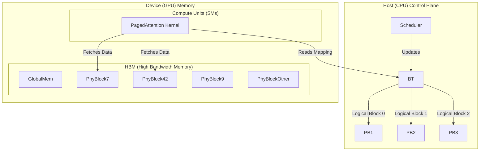

## Preamble

While studying for an LLM serving system design interview I asked gemini 3 to generate a report summarizing the field.
The report it generated is exceptonally useful and concise.
I decided to share here in case it is useful for others.

# The Architecture of Scalable LLM Serving: A Systems Engineering Survey

## 1. Introduction: The Inference System Gap

The deployment of Large Language Models (LLMs) at scale represents one of the most significant distributed systems challenges of the modern era. While the scientific community has extensively documented the internal mechanics of these models—the mathematics of attention, the properties of Rotary Positional Embeddings (RoPE), and the nuances of activation functions like SwiGLU—the engineering required to serve these models efficiently remains less understood by the broader community. There exists a profound gap between understanding how a model predicts the next token and understanding how a system serves millions of such predictions simultaneously under strict latency constraints.
The fundamental architectural challenge in LLM serving is not computational intensity, but state management. Unlike traditional deep learning models (e.g., ResNet or BERT), which are largely stateless and process fixed-size inputs, LLM inference is autoregressive and state-heavy. The system must maintain a growing Key-Value (KV) cache for every active request, creating a unique tension between memory capacity, memory bandwidth, and compute utilization.1 This report provides an exhaustive survey of the system architectures designed to resolve these tensions, analyzing the evolution from monolithic, static serving engines to today's disaggregated, paged, and speculative inference systems.

### 1.1 The Dual Phases of Inference: Prefill and Decode

To understand the architectural decisions in modern serving systems, one must first distinguish the two distinct phases of LLM generation, as they impose contradictory demands on the hardware:
The Prefill Phase: This phase processes the user's input prompt to generate the initial KV cache. It is highly parallelizable; the system can process all tokens in the prompt simultaneously. Consequently, the prefill phase is compute-bound. It saturates the Tensor Cores of modern GPUs (e.g., NVIDIA H100), achieving high arithmetic intensity and utilization.3
The Decode Phase: This phase generates output tokens one by one. Each step depends on the previous one, forcing sequential execution. To generate a single token, the GPU must load all model weights and the specific request's KV cache from High Bandwidth Memory (HBM) but performs relatively little computation (a single matrix-vector multiplication per layer). This phase is memory-bandwidth bound. The utilization of compute units drops precipitously, often below 2%, as the chip waits for data to arrive from memory.2
Designing a system that accommodates both phases on the same hardware without massive inefficiency is the central problem of LLM serving.

## 2. Memory Architecture: The Foundation of State Management

The primary bottleneck in large-scale serving is the "Memory Wall." As sequence lengths grow—now reaching into the millions of tokens—the memory footprint of the intermediate states (the KV cache) often exceeds the size of the model weights themselves. Managing this memory is not merely an optimization; it is the defining constraint of the system architecture.

### 2.1 The Physics of the KV Cache

For every token generated, the model produces Key and Value vectors for every attention head in every layer. These must be stored to calculate attention for subsequent tokens. For a model with hidden size $h$, layers $L$, and using 16-bit precision (2 bytes), the KV cache size per token is $4 \times L \times h$ bytes.
Consider a LLaMA-13B model (approx. 40 layers, 5120 hidden dimension). A single request with a 2048-token context consumes approximately 1.6 GB of VRAM.5 On an 80GB A100 GPU, naive allocation would limit concurrency to fewer than 50 requests, leaving the massive compute power of the GPU vastly underutilized.

### 2.2 Legacy Approaches: The Fragmentation Problem

Early serving systems, such as the initial versions of FasterTransformer, treated memory allocation similarly to traditional array processing. They required contiguous memory blocks. To serve a request, the system had to pre-allocate a contiguous chunk of VRAM large enough to hold the maximum possible sequence length (e.g., 2048 or 4096 tokens), because the final length of the generation is unknown a priori.
This design decision led to two catastrophic forms of waste:
Internal Fragmentation: If the system reserved 2048 slots but the request finished after 50 tokens, 97% of the allocated memory was wasted.
External Fragmentation: Even if the GPU had 10GB of free memory, if that memory was fragmented into small holes between active buffers, the system could not allocate a new contiguous block for a new request.5
Empirical analysis of these legacy systems revealed that effective memory utilization was often as low as 20%–40%, meaning the majority of the expensive HBM was occupied by "air"—reserved but unused space.7

### 2.3 The PagedAttention Paradigm

The breakthrough in memory architecture came with the introduction of PagedAttention, popularized by the vLLM project. The core insight was to borrow the concept of virtual memory paging from operating systems.

#### 2.3.1 Architectural Mechanics

In the PagedAttention architecture, the KV cache is no longer a contiguous tensor. Instead, it is divided into fixed-size blocks (e.g., 16 or 32 tokens per block).
Physical Blocks: These are allocated in non-contiguous pages of VRAM.
Logical Blocks: The request views its KV cache as a continuous sequence.
Block Table: A software-managed data structure (similar to a page table) maps logical blocks to physical block indices.6
This decoupling allows the system to allocate memory dynamically, one block at a time. As a request generates more tokens, the scheduler allocates a new physical block from a global free list and updates the request's block table. This eliminates external fragmentation entirely (since any free block can be used) and reduces internal fragmentation to the wasted space in the single last block of a sequence.5

#### 2.3.2 System Diagram: The PagedAttention Memory Hierarchy

#### 2.3.3 Kernel-Level Implications

The decision to use PagedAttention necessitates a complete rewrite of the attention kernel. Standard PyTorch attention implementations (e.g., torch.nn.functional.scaled_dot_product_attention) assume contiguous tensors. The PagedAttention kernel must:
Read the block table for the current request.
Identify the physical locations of the KV blocks.
Fetch the keys and values from these scattered locations.
Perform the attention computation.
While fetching from non-contiguous memory theoretically reduces cache locality, the performance penalty is negligible compared to the throughput gains enabled by higher batch sizes. By fitting more requests into memory, the system hides the latency of memory access more effectively.8

### 2.4 Advanced Memory Features: Sharing and Copy-on-Write

The block-based architecture enables advanced features critical for complex serving scenarios:
Memory Sharing: In scenarios like Parallel Sampling (generating multiple responses for the same prompt) or Beam Search, the initial prompt is identical for all output sequences. PagedAttention allows multiple sequences to point to the same physical blocks for the prompt tokens. The reference count for these blocks is simply incremented. This reduces the memory footprint of the prompt by a factor of $N$ (where $N$ is the number of parallel samples).7
Copy-on-Write: If a sequence needs to modify a shared block (which is rare in standard autoregressive decoding as history is immutable, but relevant in some speculative schemes or prefix-tuning), the system creates a copy of that specific block only.
Prefix Caching: For chatbots with a fixed "System Prompt" (e.g., "You are a helpful assistant..."), the blocks containing this prefix can be marked as immutable and persistent. Every new request can simply map these pre-computed blocks into its page table, saving the compute cost of processing the system prompt every time.10

## 3. Scheduling Architecture: From Batches to Streams

With a flexible memory architecture in place, the burden shifts to the scheduler. The scheduler determines which requests run on the GPU at any given millisecond. The evolution from static to continuous batching represents the second major pillar of modern inference architecture.

### 3.1 The Inefficiency of Static Batching

In traditional serving (e.g., TensorFlow Serving for ResNet), requests are grouped into a "batch" and processed together. The batch only finishes when all requests in it are complete.
In LLMs, request lengths vary wildly. A batch might contain one request generating 5 tokens and another generating 500. Under static batching, the GPU continues to process the batch for 500 iterations. The slot occupied by the short request sits idle for 495 iterations, wasting valuable memory and compute slots. This "tail latency" problem causes massive underutilization.6

### 3.2 Continuous (In-Flight) Batching

Continuous batching (also known as Iteration-Level Scheduling or In-Flight Batching) completely decouples the batch management from the request lifecycle.

#### 3.2.1 The Iteration Loop

The inference engine operates in a tight loop where one iteration corresponds to the generation of one token for all active requests.
Step Start: The scheduler checks the status of all active requests.
Eviction: Requests that have generated an End-of-Sequence (EOS) token or reached their limit are removed immediately. Their physical memory blocks are freed.
Insertion: New requests from the waiting queue are inserted into the vacated slots in the batch.
Execution: The model runs one forward pass for the current set of requests.
Step End: The newly generated tokens are appended to the request states.
This architecture transforms the GPU into a streaming processor. The "batch size" fluctuates dynamically at every step. Throughput is maximized because slots are refilled the moment they become available.11
Architecture Diagram: Continuous Batching Flow
Time T=0: Batch =
Time T=5: Req A finishes. Batch = -> Empty Slot Available.
Time T=6: Scheduler injects Req C. Batch =.
Result: No idle slots.

### 3.3 The Stall Problem and Chunked Prefill

While continuous batching solves the decode-phase efficiency, it introduces a new problem: Prefill Interference.
When a new request joins the batch, it must go through the prefill phase. If the prompt is long (e.g., 4000 tokens), the prefill computation might take 50-100ms. During this time, the existing requests in the decode phase (which expect a token every 10-20ms) are blocked, causing a noticeable "stutter" in generation.
Solution: Chunked Prefill (Piggybacking)
To mitigate this, modern schedulers (like in vLLM and SGLang) implement Chunked Prefill. The scheduler splits the long prompt into smaller chunks (e.g., 512 tokens).
Iteration 1: The GPU processes the decode steps for existing requests + the first 512 tokens of the new request's prefill.
Iteration 2: The GPU processes the next decode steps + the next 512 tokens of the prefill.
...
Iteration N: The prefill is complete, and the new request switches to decode mode.
This "time-slicing" of the prefill phase ensures that the Inter-Token Latency (ITL) for ongoing requests remains smooth, even when massive prompts are being ingested.10

### 3.4 Preemption and the Multi-Level Queue

Under high load, the system may run out of GPU blocks entirely. The scheduler must decide which requests to prioritize.
Swapping: vLLM implements a SWAPPED state. When memory pressure hits critical levels, the scheduler identifies a victim request (usually based on priority or arrival time). It moves the request's KV blocks from GPU HBM to CPU RAM. The request is paused.
Resumption: When blocks become available, the scheduler swaps the KV cache back to GPU and resumes generation.
Recomputation: In systems with slow PCIe links where swapping is too expensive, the scheduler might simply drop the blocks and recompute the KV cache from scratch (using the prompt and generated tokens) when resources free up. This is a trade-off between compute cost and I/O bandwidth.10

## 4. Distributed Inference Architectures

As models scale beyond the VRAM capacity of a single GPU (e.g., Llama-3-70B requires ~140GB, fitting on two A100-80GBs), distributed inference becomes mandatory. The architecture for inference distribution differs significantly from training distribution due to the latency sensitivity.

### 4.1 Tensor Parallelism (TP): Intra-Node Scaling

Tensor Parallelism is the standard technique for splitting a model across GPUs within a single server (node).
Mechanism: It splits the individual weight matrices. For a linear layer $Y = XW$, the matrix $W$ is sliced (e.g., column-wise). Each GPU holds a slice of $W$ and computes a partial product.
Communication: An All-Reduce operation is required to sum the partial results across all GPUs after every layer.
Constraint: Because synchronization happens per layer (dozens of times per forward pass), the communication latency must be extremely low. This requires high-bandwidth interconnects like NVIDIA NVLink (900 GB/s). TP effectively aggregates the memory bandwidth and compute of multiple GPUs into a single virtual accelerator.16

### 4.2 Pipeline Parallelism (PP): Inter-Node Scaling

When a model is too large for a single node (or to scale throughput), Pipeline Parallelism is used.
Mechanism: The model layers are partitioned into stages. Node 1 holds Layers 1-40, Node 2 holds Layers 41-80.
Data Flow: The activation of Layer 40 on Node 1 is sent to Node 2 to begin Layer 41.
Communication: Point-to-point communication is only needed at the boundaries of the stages. This is tolerant of lower bandwidth (e.g., Ethernet) and is suitable for multi-node clusters.
The Bubble: PP introduces "bubbles"—periods where Node 2 is idle waiting for Node 1 to finish. In training, this is hidden by huge batch sizes. In inference, bubbles are harder to hide, leading to latency overheads.
Hybrid Architecture (TP+PP): The most common setup for massive models is TP within a node (to fit the layers) and PP between nodes (to scale size further). For example, a 16-GPU cluster (2 nodes of 8 GPUs) might use TP=8 and PP=2.18

## 5. Disaggregated Serving: The "Splitwise" Revolution

One of the most significant architectural shifts in 2024-2025 is the move towards Disaggregated Serving. This paradigm acknowledges that Prefill and Decode are fundamentally different workloads that should not compete for the same resources.

### 5.1 The Interference Problem

In a monolithic system (where every GPU does both prefill and decode), the "goodput" (the rate of requests served within Service Level Objectives) is limited by interference.
A massive prefill request spikes memory bandwidth usage, stalling decode requests.
Reserving memory for prefill bursts leaves memory idle during decode-heavy periods.
Scaling the cluster to handle prefill bursts results in over-provisioned decode compute that sits idle.4

### 5.2 The DistServe / Splitwise Architecture

Disaggregated architectures physically separate the cluster into two pools:
Prefill Instances: Optimized for compute throughput. They process prompts and generate the initial KV cache.
Decode Instances: Optimized for memory capacity and bandwidth. They take the KV cache and generate tokens.
The Workflow:
Router: Directs the incoming request to a Prefill Instance.
Prefill: The instance processes the prompt.
KV Transfer: The generated KV cache is transferred over the network to a Decode Instance.
Decode: The Decode Instance loads the KV cache and continues generation.
Benefits:
Isolation: A massive prompt no longer affects the latency of ongoing chat users.
Independent Scaling: If user prompts get longer (e.g., RAG workloads), you can add more Prefill Instances without adding expensive Decode Instances.
Resource Specialization: Future hardware could be specialized—compute-heavy chips for prefill, memory-heavy chips for decode.20

### 5.3 The Bottleneck: KV Cache Transfer

The viability of disaggregation hinges on one metric: Transfer Latency.
Transferring a 1GB KV cache over standard TCP/IP is slow (hundreds of milliseconds). To make disaggregation practical, the transfer time must be negligible compared to the decoding time.
Solution: RDMA and Custom Protocols (KVDirect / LMCache)
Architectures like KVDirect utilize RDMA (Remote Direct Memory Access).
Zero-Copy: The network card transfers data directly from the source GPU memory to the destination GPU memory, bypassing the CPU and OS kernel.
Pull-Based Scheduling: The Decode Instance "pulls" the KV cache only when it has a free slot, preventing bufferbloat.
Performance: RDMA achieves transfer speeds of ~400 Gbps, compared to ~80 Gbps for TCP offloading. This reduces the transfer penalty to the microsecond range, making the split invisible to the user.23

### 5.4 Intra-GPU Disaggregation: Nexus

For smaller deployments where physical disaggregation (separate nodes) is too costly or complex, systems like Nexus implement logical disaggregation within a single GPU.
Mechanism: Nexus partitions the GPU's Streaming Multiprocessors (SMs). It might dedicate SMs 0-60 to Decode and SMs 61-80 to Prefill.
Dynamic Rebalancing: The scheduler adjusts this boundary in real-time (sub-second intervals) based on queue depth. If the prefill queue spikes, it steals SMs from the Decode pool (within the limits of the SLA).
Impact: This achieves the isolation benefits of DistServe without the network transfer overhead.25

## 6. Multi-Tenancy and Efficiency Architectures

Beyond handling single massive models, infrastructure must often serve thousands of smaller, specialized models (e.g., a platform hosting user-finetuned LLaMA adapters).

### 6.1 Parameter Remapping: Oneiros / MIRAGE

In a multi-tenant environment, the GPU memory is split between Model Weights (parameters) and KV Cache. Ideally, you want to maximize KV Cache to support high batch sizes. However, hosting 10 inactive models wastes gigabytes of HBM on weights that aren't being used.
Oneiros Architecture:
Oneiros treats model weights as evictable pages, just like the KV cache.
Concept: It creates a unified memory pool. If Model A is active and Model B is idle, Model B's weights are evicted to CPU RAM. The freed HBM is dynamically remapped to serve as KV Cache for Model A.
Just-in-Time Loading: When a request for Model B arrives, the system swaps Model B's weights back in. Crucially, it uses Layer-wise Pipelining: it loads Layer 1 of Model B, starts computing Layer 1, and simultaneously loads Layer 2. This hides the PCIe transfer latency behind the compute.27

### 6.2 Multi-Tier Caching: LMCache

For RAG (Retrieval Augmented Generation) applications, the system often sees the same documents repeatedly (e.g., "Analyze this 50-page PDF"). Re-running the prefill phase for the same PDF every time is wasteful.
LMCache Architecture:
LMCache treats the KV cache as a retrievable asset. It implements a storage hierarchy:
L1 (GPU): Active KV blocks.
L2 (CPU): Recently used blocks (swapped out).
L3 (Local Disk): NVMe storage for persistence.
L4 (Remote): Redis or Object Store for sharing across the cluster.
When a request arrives, the system hashes the prompt. If the hash matches a stored KV cache in L4 (Remote Redis), it streams the pre-computed KV cache directly to the GPU. This effectively turns "Computation" (Prefill) into "IO" (Retrieval), which is significantly cheaper and faster for long contexts.23
Table 1: Storage Hierarchy Latency vs Capacity 29
Tier
Device
Latency
Capacity
Use Case
L1
GPU HBM
~0.1 ms
80 GB
Active Generation
L2
CPU DRAM
~5 ms
1-2 TB
Swapped/Paused Requests
L3
Local NVMe
~50 ms
4-8 TB
Single-Node Cache
L4
Remote Redis
~200 ms
Infinite
Cross-Node Sharing

## 7. Speculative Decoding Systems

Speculative Decoding (SD) is an architectural pattern designed to break the sequential dependency of the Decode phase. It leverages the fact that memory access is expensive but compute is cheap (since the GPU is underutilized during decode).

### 7.1 The Draft-Verify Architecture

The system employs two models:
Draft Model: A small, fast model (e.g., LLaMA-68M) that approximates the target model.
Target Model: The large, capable model (e.g., LLaMA-70B).
Execution Loop:
Speculate: The Draft Model generates $K$ tokens (e.g., 5 tokens) autoregressively. Since it is small, this is fast.
Verify: The Target Model processes the original input + the 5 draft tokens in one single forward pass. It outputs the probabilities for all 5 positions.
Accept/Reject: The system compares the draft tokens against the target probabilities. If the first 3 match, they are accepted. The 4th is rejected and corrected.
Result: The system generated 3 tokens for the cost of 1 target model pass.

### 7.2 System Integration Challenges

Integrating SD into a serving engine like vLLM is complex.
Scheduling Complexity: The "Verify" step might accept 1 token for Request A and 5 tokens for Request B. The batch becomes "ragged" in time. The scheduler must realign these requests.
Draft Model Management: The Draft Model consumes memory. The system must balance the memory allocated to the Draft Model vs the KV Cache of the Target Model.
Rejection Sampling: The verification logic must be implemented efficiently in the CUDA kernel to avoid round-trips to the CPU. If the CPU has to intervene to check every token, the overhead destroys the speedup.31

### 7.3 Distributed Speculative Decoding (DSD)

New architectures like SLED propose placing the Draft Model on the Edge (e.g., the user's laptop or a local gateway) and the Target Model in the Cloud.
The laptop generates 5 tokens and sends them to the cloud.
The cloud verifies them and sends back the correction.
This hybrid architecture reduces cloud compute costs (offloading drafting to the edge) and reduces latency (if the network round-trip is faster than the cloud generating tokens sequentially).33

## 8. Framework Case Studies: vLLM vs. TensorRT-LLM

To conclude the survey, we compare the two dominant open-source architectures, as they represent opposing design philosophies.

### 8.1 vLLM: The Flexible Orchestrator

Design Philosophy: Agility and ease of use. Logic is primarily in Python; performance-critical ops are custom CUDA kernels.
Memory: PagedAttention is the core differentiator.
Kernels: Uses "JIT-compiled" style flexibility. It can handle almost any model architecture found on Hugging Face.
Trade-off: The Python scheduler introduces a small CPU overhead (microseconds), which is negligible for large batches but measurable for single-request low-latency cases.
Best For: High-throughput batch serving, diverse model support, research experimentation.8

### 8.2 TensorRT-LLM: The Compiled Engine

Design Philosophy: Maximum hardware efficiency. The model is compiled into a static execution graph (TensorRT Engine).
Kernels: Heavily utilizes Kernel Fusion. It fuses operations (e.g., LayerNorm + Gemm + Activation) into single kernels to reduce memory I/O. It uses In-Flight Batching (similar to continuous batching) implemented in C++.
Optimization: Aggressive quantization (FP8) and hardware-specific tuning for H100s.
Trade-off: The compilation step is slow. The graph is static (changing the batch size limit or sequence length often requires re-building). Less flexible for dynamic model architectures.
Best For: Production environments with fixed models, ultra-low latency requirements, maximizing H100 ROI.12

## 9. Conclusion

The architecture of LLM serving systems has evolved from simple model wrappers to complex operating systems for distributed compute. The modern stack—comprising PagedAttention for memory virtualization, continuous batching for scheduling, and RDMA-enabled disaggregation for scaling—reflects a deep integration of systems engineering principles.
The central decision for any architect is identifying the bottleneck:
Memory Capacity Limited? Use PagedAttention and Oneiros (Parameter Offloading).
Compute Limited (Prefill)? Use Disaggregated Serving (DistServe) to scale prefill nodes.
Latency Limited? Use TensorRT-LLM (Kernel Fusion) and Speculative Decoding.
Context Limited? Use LMCache to turn computation into retrieval.
As models continue to grow, the trend points inevitably toward further disaggregation and heterogeneity, where the "server" is no longer a box, but a fluid pipeline of specialized resources spanning edge and cloud.
## Works cited
1. A Survey on Large Language Model Acceleration based on KV Cache Management - arXiv, accessed November 30, 2025, https://arxiv.org/html/2412.19442v3
2. PRESERVE: Prefetching Model Weights and KV-Cache in Distributed LLM Serving - arXiv, accessed November 30, 2025, https://arxiv.org/html/2501.08192v2
3. 1 Introduction - arXiv, accessed November 30, 2025, https://arxiv.org/html/2503.06433v1
4. Proactive Intra-GPU Disaggregation of Prefill and Decode in LLM Serving - arXiv, accessed November 30, 2025, https://arxiv.org/html/2507.06608v4
5. The Architecture Behind vLLM: How PagedAttention Improves Memory Utilization - Medium, accessed November 30, 2025, https://medium.com/@mandeep0405/the-architecture-behind-vllm-how-pagedattention-improves-memory-utilization-2f9b25272110
6. LLM Inference: Continuous Batching and PagedAttention - Insu Jang, accessed November 30, 2025, https://insujang.github.io/2024-01-07/llm-inference-continuous-batching-and-pagedattention/
7. vLLM and PagedAttention: A Comprehensive Overview | by Abonia Sojasingarayar | Medium, accessed November 30, 2025, https://medium.com/@abonia/vllm-and-pagedattention-a-comprehensive-overview-20046d8d0c61
8. Why is vLLM Outperforming TensorRT-LLM (Nvidia's deployment library)? My Shocking Benchmarks on GPT-OSS-120B with H100 : r/LocalLLaMA - Reddit, accessed November 30, 2025, https://www.reddit.com/r/LocalLLaMA/comments/1oyawkl/why_is_vllm_outperforming_tensorrtllm_nvidias/
9. vAttention: Dynamic Memory Management for Serving LLMs without PagedAttention - arXiv, accessed November 30, 2025, https://arxiv.org/html/2405.04437v1
10. Inside vLLM: Anatomy of a High-Throughput LLM Inference System, accessed November 30, 2025, https://blog.vllm.ai/2025/09/05/anatomy-of-vllm.html
11. How continuous batching enables 23x throughput in LLM inference while reducing p50 latency - Anyscale, accessed November 30, 2025, https://www.anyscale.com/blog/continuous-batching-llm-inference
12. Boosting LLMs performance in production - SoftwareMill, accessed November 30, 2025, https://softwaremill.com/boosting-llms-performance-in-production/
13. NVIDIA TensorRT-LLM Supercharges Large Language Model Inference on NVIDIA H100 GPUs, accessed November 30, 2025, https://developer.nvidia.com/blog/nvidia-tensorrt-llm-supercharges-large-language-model-inference-on-nvidia-h100-gpus/
14. vllm.config.scheduler, accessed November 30, 2025, https://docs.vllm.ai/en/v0.11.1/api/vllm/config/scheduler.html
15. Explaining the Code of the vLLM Inference Engine | by Charles L. Chen | Medium, accessed November 30, 2025, https://medium.com/@crclq2018/explaining-the-source-code-behind-the-vllm-fast-inference-engine-91429f54d1f7
16. Distributed inference with vLLM | Red Hat Developer, accessed November 30, 2025, https://developers.redhat.com/articles/2025/02/06/distributed-inference-with-vllm
17. Breaking Down Parallelism Techniques in Modern LLM Inference | by Hao C. - Medium, accessed November 30, 2025, https://medium.com/@chenhao511132/parallelism-in-llm-inference-c0b6bdc5f693
18. Parallelism and Scaling - vLLM, accessed November 30, 2025, https://docs.vllm.ai/en/v0.10.2/serving/parallelism_scaling.html
19. DistServe: Disaggregating Prefill and Decoding for Goodput-optimized Large Language Model Serving - arXiv, accessed November 30, 2025, https://arxiv.org/html/2401.09670v3
20. [2401.09670] DistServe: Disaggregating Prefill and Decoding for Goodput-optimized Large Language Model Serving - arXiv, accessed November 30, 2025, https://arxiv.org/abs/2401.09670
21. Prefill-Decode Aggregation or Disaggregation? Unifying Both for Goodput-Optimized LLM Serving - arXiv, accessed November 30, 2025, https://arxiv.org/html/2508.01989v1
22. DistServe: Disaggregating Prefill and Decoding for Goodput-optimized Large Language Model Serving | USENIX, accessed November 30, 2025, https://www.usenix.org/conference/osdi24/presentation/zhong-yinmin
23. LMCache: An Efficient KV Cache Layer for Enterprise-Scale LLM Inference - arXiv, accessed November 30, 2025, https://arxiv.org/html/2510.09665v1
24. KVDirect: Distributed Disaggregated LLM Inference - arXiv, accessed November 30, 2025, https://arxiv.org/html/2501.14743v1
25. Nexus: Proactive Intra-GPU Disaggregation of Prefill and Decode in LLM Serving - arXiv, accessed November 30, 2025, https://arxiv.org/html/2507.06608v5
26. Nexus:Proactive Intra-GPU Disaggregation of Prefill and Decode in LLM Serving - arXiv, accessed November 30, 2025, https://arxiv.org/pdf/2507.06608
27. Oneiros: KV Cache Optimization through Parameter Remapping for Multi-tenant LLM Serving - arXiv, accessed November 30, 2025, https://arxiv.org/html/2507.11507v2
28. [2507.11507] Oneiros: KV Cache Optimization through Parameter Remapping for Multi-tenant LLM Serving - arXiv, accessed November 30, 2025, https://arxiv.org/abs/2507.11507
29. Architecture Overview - LMCache, accessed November 30, 2025, https://docs.lmcache.ai/developer_guide/architecture.html
30. Redis - LMCache, accessed November 30, 2025, https://docs.lmcache.ai/kv_cache/storage_backends/redis.html
31. How Speculative Decoding Boosts vLLM Performance by up to 2.8x, accessed November 30, 2025, https://blog.vllm.ai/2024/10/17/spec-decode.html
32. Optimizing Speculative Decoding for Serving Large Language Models Using Goodput, accessed November 30, 2025, https://arxiv.org/html/2406.14066v2
33. 1 Introduction - arXiv, accessed November 30, 2025, https://arxiv.org/html/2511.21669v1
34. SLED: A Speculative LLM Decoding Framework for Efficient Edge Serving - arXiv, accessed November 30, 2025, https://arxiv.org/html/2506.09397v3
35. Comparative Analysis of Large Language Model Inference Serving Systems: A Performance Study of vLLM and HuggingFace TGI - arXiv, accessed November 30, 2025, https://arxiv.org/html/2511.17593
36. vLLM vs TensorRT-LLM: Key differences, performance, and how to run them - Northflank, accessed November 30, 2025, https://northflank.com/blog/vllm-vs-tensorrt-llm-and-how-to-run-them
